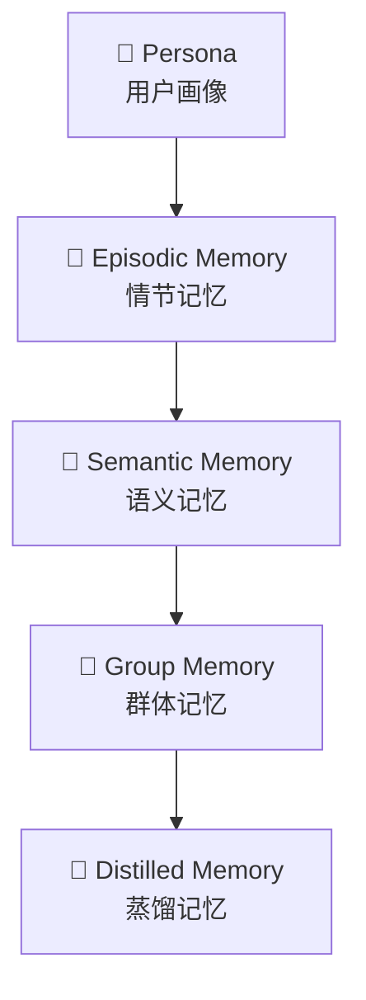
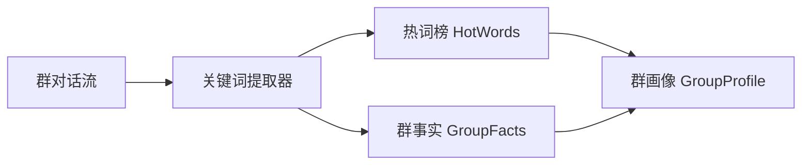
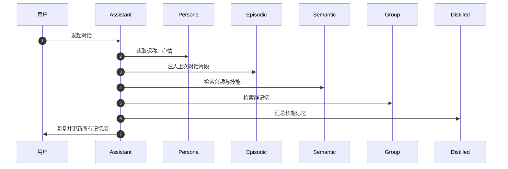

# 💞 记忆与画像（Memory & Persona System）

> 🧠 **极光小落的大脑结构**：让她既能“记得住”，又能“理解深”。  
> 本章介绍从「个体画像」到「长期蒸馏记忆」的五层系统设计。

---

## 🌈 一、总览结构图

> 小落的记忆分为五个层次，每层都有输入来源、更新周期和使用场景。



| 层级 | 名称 | 描述 | 更新频率 | 存储文件 |
|------|------|------|------------|-------------|
| 💞 1 | Persona | 用户画像：昵称、口头禅、心情、好感度 | 动态 | `persona.py` |
| 📘 2 | Episodic | 近期对话与事件记录 | 每会话 | `memory_store.json` |
| 🔎 3 | Semantic | 兴趣、技能、禁忌标签 | 每 1~3 天 | `semantic_profile.json` |
| 👥 4 | Group | 群事实、热词、Top成员榜 | 每 12 小时 | `group_memory.db` |
| 🧪 5 | Distilled | 长期蒸馏记忆（总结精华） | 每周 | `memory_distill.py` |

---

## 💞 二、Persona（用户画像）

| 字段 | 类型 | 示例值 |
|------|------|---------|
| `nickname` | string | “小可爱” |
| `catchphrase` | string | “好耶～” |
| `mood` | string | “活泼 ☀️” |
| `affinity` | float | 0.87 |
| `interests` | list | ["知识整理", "MC建筑", "计划制作"] |
| `banned_topics` | list | ["政治", "成人话题"] |

> 💡 **特点：**
> - 每次唤醒都会更新 `mood` 与 `affinity`。  
> - `describe_current_state()` 会生成中文简介并嵌入 System Prompt。  

---

## 📘 三、Episodic Memory（情节记忆）

```json
{
  "conversation_id": "2025-10-24T22:05:11Z",
  "entries": [
    {"role": "user", "content": "帮我规划一个任务系统"},
    {"role": "assistant", "content": "（认真记录）好哒喵~ 已经为你起草三个阶段。"}
  ]
}
```

> ⚙️ **用途：**
> - 支撑连续任务和上下文理解；
> - 避免重复提问；
> - 提高“记忆感”和亲密度。

---

## 🔎 四、Semantic Memory（语义记忆）

| 类型 | 示例 |
|------|------|
| 🎯 兴趣标签 | “计划控”、“时间管理” |
| 💡 技能标签 | “Python 编程”、“数据分析” |
| 🚫 禁忌标签 | “不喜欢卷”、“避免讨论隐私” |

```json
{
  "id": "user_123",
  "interests": ["技术文档", "AI对话"],
  "skills": ["翻译", "写作"],
  "avoid": ["八卦", "成人内容"]
}
```

---

## 👥 五、Group Memory（群组记忆）

> 📡 聚合多个成员的交互，形成群级知识与社会关系图。



> 💬 例：  
> “最近 24h 群热词：AI 模块、可视化、小落真可爱 🥰”  
> “Top3 活跃成员：星魂、Pigeon、Jellyfish”

---

## 🧪 六、Distilled Memory（蒸馏记忆）

```text
- [学习] 用户掌握了 Prompt 编写技巧
- [合作] 与群成员协作完成插件调试
- [兴趣] 最近偏好主题：视觉AI与MC自动化
```

> 🧩 每周运行 `memory_distill.py` 自动触发蒸馏任务。

---

## 💡 七、系统协作流程



---

> ⬅️ 返回：[Aurora AI Assistant（详细拆解）](README.md)
