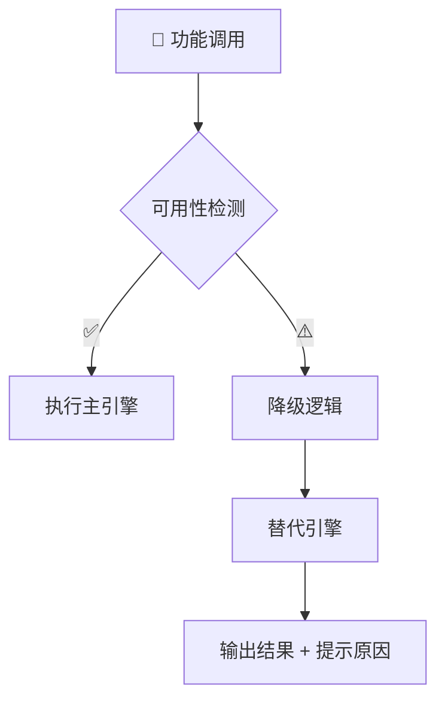

# ⚙️ 调试与降级机制（Debug & Degrade System）

> 🧩 **目标**：让「极光小落」始终稳定运行，即使模型、网络或语音服务异常，也能优雅降级并告知用户。

---

## 🌈 一、概览



| 模块 | 主方案 | 降级方案 |
|------|---------|-----------|
| 🧠 LLM | Doubao Seed | OpenAI / fallback |
| 🧮 向量检索 | Faiss | HNSW → Naive |
| 👁 OCR | RapidOCR | Tesseract |
| 🔊 TTS | Edge TTS | gTTS → Text |
| 🧏 STT | Whisper | 本地识别 |

---

## 🧠 二、Debug 模式

```json
{
  "backend": "seed",
  "embedding": "faiss",
  "tts": "edge_tts",
  "latency": "1.2s"
}
```

> 💡 启用方法：输入 `debug` 或 `/diag`。

---

## 📉 三、降级路径

| 模块 | 优先级链 |
|------|------------|
| LLM | Seed → OpenAI → 简要模板 |
| 向量 | Faiss → HNSW → Naive |
| TTS | Edge → gTTS → Text |
| OCR | RapidOCR → Tesseract |


---

## 📢 四、提示与日志

```text
WARN once: Embedding backend -> HNSW
WARN once: TTS engine switched to gTTS
```

> 仅首次触发显示，避免干扰体验。

---

## 🧩 五、常见降级场景

| 场景 | 原因 | 行为 |
|------|------|------|
| 🌐 网络波动 | 模型超时 | 使用 OpenAI |
| 💾 内存不足 | 索引崩溃 | 启用 HNSW |
| 🔇 TTS 超时 | 语音失败 | 改为文本输出 |

> ⚠️ “当前 TTS 暂不可用，小落已切换至 gTTS 喵~”

---

> ⬅️ 返回：[Aurora AI Assistant（详细拆解）](README.md)
