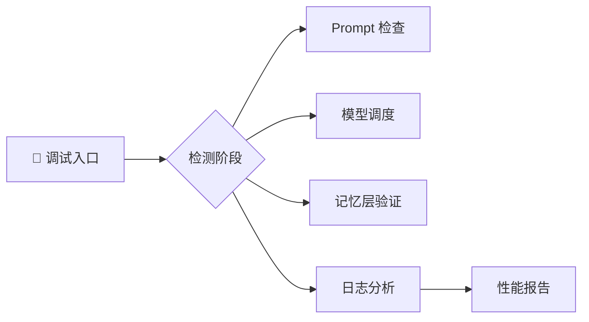

# 🧩 调试与测试建议（Debugging & QA Guide）

> 🎯 **目标**：让「极光小落」可验证、可复现、可优化。

---

## 🌈 一、调试流程

| 步骤 | 操作 | 命令 |
|------|------|------|
| 1️⃣ | 检查 Prompt | `get_full_prompt_v4()` |
| 2️⃣ | 查看模型状态 | `diag.report()` |
| 3️⃣ | 验证记忆层 | `persona.describe_current_state()` |
| 4️⃣ | 单元测试 | `run_ai_tests.py` |

---

## 🧭 二、Prompt 调试清单

| 检查项 | 方法 |
|---------|------|
| ✅ System Prompt 是否加载 | 查看是否包含“你是中文猫娘助手” |
| ✅ Persona Summary 注入 | 检查 `【小落状态】` 段 |
| ⚠️ 语气漂移 | 检查语言风格 |

---

## 🧮 三、性能监控

| 指标 | 理想范围 |
|------|-----------|
| LLM 延迟 | < 2.5s |
| 向量召回 | < 0.8s |
| OCR 响应 | < 1.2s |

> ⚠️ 超标时检查降级链触发频次。

---

## 🧰 四、常用命令

| 命令 | 功能 |
|------|------|
| `/debug` | 调试模式 |
| `/diag` | 系统状态 |
| `/status` | 当前任务 |
| `/memory` | 导出记忆 |
| `/regen` | 重新生成 |

---

> ⬅️ 返回：[Aurora AI Assistant（详细拆解）](README.md)
