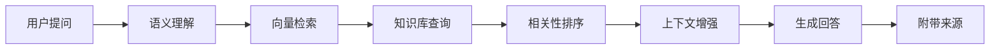

# ✨ 特性展示（Features Showcase）

  <h2 class="features-title">小落的超能力</h2>
  
探索每一个让她与众不同的特性

---

## 🎯 核心能力总览

### 💬 自然对话引擎

**就像和朋友聊天一样自然**

小落使用先进的大语言模型，能够：
- 理解你的真实意图，而不只是关键词匹配
- 保持多轮对话的上下文连贯性
- 用自然、流畅的语言表达

  

    
小落，我今天好累...

    
听起来你今天很辛苦呢。要不要和我聊聊发生了什么？我一直在这里听你说。🌸

    
就是工作压力大

    
我能理解，工作压力确实会让人很疲惫。不过你已经做得很好了！需要我帮你放松一下吗？或者我们可以聊点开心的事～

  

**特性亮点：**
- ✅ 情感识别与共情回应
- ✅ 上下文理解与记忆
- ✅ 多样化的表达方式
- ✅ 自然的对话流程

---

### 🧠 智能记忆系统

**她真的会记住你**

小落拥有双重记忆机制：

**📝 短期记忆（STM）**
- 记住当前对话的所有细节
- 理解指代关系（"它"、"那个"等）
- 保持话题连贯性

**💾 长期记忆**
- 记住你的昵称偏好
- 了解你的兴趣爱好
- 记得重要的日期和事件
- 建立个性化用户画像

  

    

      第1天
      

        <strong>用户：</strong>我叫小明，喜欢打游戏
      

    

    

      第7天
      

        <strong>小落：</strong>小明，今天想玩什么游戏吗？😊
      

    

    

      第30天
      

        <strong>小落：</strong>记得你喜欢 RPG 游戏，最近发现了一款新游戏推荐给你！
      

    

  

**记忆能力：**
- ✅ 用户基本信息（昵称、喜好）
- ✅ 对话历史与关键话题
- ✅ 交互风格偏好
- ✅ 重要时间节点

---

### 📚 RAG 知识检索

**不只是回答，更提供可信的知识**

小落使用 Retrieval-Augmented Generation (RAG) 技术：

**工作流程：**

  

    
❓ Minecraft 中如何合成钻石镐？

    

      <strong>小落的回答：</strong> 
      钻石镐需要 3 个钻石和 2 根木棍合成。排列方式是： 
      - 顶部一排：3个钻石 
      - 中间：1根木棍 
      - 底部：1根木棍  
      <em>📖 来源：MC 百科 - 工具合成</em>
    

  

**检索优势：**
- ✅ 准确的知识来源
- ✅ 减少幻觉（AI编造）
- ✅ 实时更新的知识
- ✅ 支持私有知识库

---

### 🎭 Persona 人格系统

**有个性的 AI 助手**

小落不是千篇一律的机器人，而是有独特性格的存在：

**可配置的人格特质：**
- 🌸 **温柔型**：耐心、体贴、善解人意
- 🎨 **活泼型**：幽默、俏皮、充满活力
- 🧠 **专业型**：严谨、详细、学术风格
- 💝 **贴心型**：关怀、温暖、情感丰富

  

    
🌸 温柔模式

    

      "慢慢来，不着急哦～我会一直陪着你，直到问题解决为止。💕"
    

  

  

    
🎨 活泼模式

    

      "哈哈，这个问题我知道！让我来告诉你一个超酷的解决方案！✨"
    

  

  

    
🧠 专业模式

    

      "根据技术文档，建议采用以下方案。以下是详细步骤..."
    

  

**人格化优势：**
- ✅ 更有亲和力的交互体验
- ✅ 适应不同场景需求
- ✅ 建立情感连接
- ✅ 持续一致的性格表现

---

### 🎮 丰富的插件生态

**功能扩展，无限可能**

小落支持多种插件，满足不同需求：

**📺 AuroraBili - B站助手**
- UP主动态追踪
- 视频信息查询
- 热门内容推送
- 直播状态监控

**📖 AuroraBK - 百科查询**
- Minecraft 百科
- 游戏攻略查询
- 物品合成配方
- 模组信息检索

**🎨 AuroraGM - 菜单图卡**
- 精美卡片生成
- 自定义样式
- 信息可视化
- 图片分享功能

**🔌 AuroraHTTP - API 扩展**
- 自定义接口对接
- 第三方服务集成
- Webhook 支持
- 数据交互灵活

**💾 AuroraDB - 数据存储**
- 用户数据管理
- 群组信息存储
- 历史记录查询
- 数据导出功能

**插件特点：**
- ✅ 模块化设计
- ✅ 按需启用
- ✅ 易于扩展
- ✅ 独立配置

---

### 🛡️ 安全与隐私保护

**你的数据，你做主**

小落严格遵守隐私保护原则：

**🔐 数据最小化**
- 只收集必要信息
- 自动清理过期数据
- 不保存敏感内容

**👁️ 完全透明**
- 数据使用说明
- 处理流程公开
- 隐私政策明确

**💾 用户掌控**
- 随时导出数据
- 一键清除记忆
- 自主权限管理

**🔒 安全加密**
- 数据传输加密
- 存储安全防护
- 访问权限控制

**隐私承诺：**
- ✅ 不会出售用户数据
- ✅ 不会用于训练商业模型
- ✅ 支持完全本地部署
- ✅ 遵守数据保护法规

---

## 🎪 互动演示（Interactive Demo）

### 🌈 能力对比

| 特性 | 传统机器人 | 小落 Aurora |
|------|------------|-------------|
| 对话理解 | 关键词匹配 | ✅ 深度语义理解 |
| 记忆能力 | ❌ 无记忆 | ✅ 长短期记忆 |
| 个性化 | ❌ 固定回复 | ✅ 千人千面 |
| 知识来源 | 预设数据 | ✅ RAG 实时检索 |
| 情感理解 | ❌ 不支持 | ✅ 情感识别 |
| 扩展性 | 受限 | ✅ 丰富插件 |
| 隐私保护 | 未知 | ✅ 完全透明 |

### 📊 性能指标

  
95%+

  
意图识别准确率

  
&lt;500ms

  
平均响应时间

  
30天+

  
长期记忆保持

  
10+

  
可用插件数量

---

## 🚀 即将到来（Coming Soon）

**🎯 近期计划**
- 🎨 多模态理解（图片、语音）
- 🌐 多语言支持
- 🎵 语音交互功能
- 📱 移动端优化

**🌟 长期愿景**
- 🎬 视频内容生成（Sora 集成）
- 🧠 更强的推理能力
- 🤝 多人协作场景
- 🌍 跨平台部署

---

## 💡 使用建议

**🎯 最佳实践**

1. **充分利用记忆功能**
   - 告诉小落你的喜好和习惯
   - 让她记住你喜欢的称呼方式
   - 定期回顾和更新个人信息

2. **善用知识检索**
   - 提问时提供足够的上下文
   - 询问来源以验证信息准确性
   - 使用专业术语提高检索精度

3. **调整人格设置**
   - 根据场景选择合适的 Persona
   - 尝试不同风格找到最适合的
   - 给予反馈帮助优化表现

4. **探索插件功能**
   - 了解每个插件的能力
   - 组合使用创造更多可能
   - 反馈需求帮助开发新插件

---

## 🎁 特别功能

### 🎨 自定义表情包
小落可以根据对话情境使用合适的 emoji 和表情，让交流更生动！

### 📅 定时提醒
设置重要事项提醒，小落会在合适的时间通知你。

### 🎲 趣味互动
支持各种小游戏和娱乐功能，不只是工具，更是伙伴。

### 📊 使用统计
查看你和小落的互动历史，了解交流模式。

---

  <h3>准备好体验小落的能力了吗？</h3>
  
查看 <a href="Usage-Guide.md">使用指南</a> 开始你的 Aurora 之旅！

---

**相关阅读**
- [返回首页](README.md)
- [小落的故事](Story.md)
- [AI 核心技术](AI-Core.md)
- [插件详细说明](Plugins.md)
