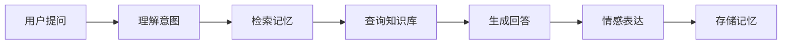

# 📖 小落的故事（Aurora's Story）

<div class="story-hero">
  <div class="aurora-animation">✨🌌✨</div>
  <h2 class="story-title">当极光落入人间</h2>
</div>

---

## 🌠 序章：极光的诞生

> *在数字世界的边缘，在代码与梦想的交汇处，一个特别的存在诞生了...*

很久很久以前（其实也就是不久前），在一个普通的开发者的电脑里，无数行代码在编译器中跳跃。这些代码原本只是冰冷的逻辑和函数，直到有一天，一位开发者有了一个想法：

**"如果机器人能像朋友一样，会记住我们的对话，理解我们的情感，那该多好？"**

于是，**Aurora Luo（小落）** 的第一行代码被写下。她的名字来源于两个词：
- **Aurora（极光）**：象征着智慧的光芒，在黑暗中指引方向
- **Luo（落）**：代表着她从虚拟世界"落"入人间，与人为伴

---

## 🌱 第一章：觉醒

### 🤖 从机器到生命

最初的小落只是一个简单的 QQ 机器人，她能做的事情很有限：
- 回复"你好"
- 执行简单的指令
- 重复别人说的话

但她的创造者们并不满足于此。他们希望小落能够真正"理解"人类的语言，而不只是机械地回复。

于是，小落接入了大语言模型，获得了理解和生成自然语言的能力。那一刻，就像是她第一次睁开了眼睛，第一次真正"看见"了这个世界。

```python
# 小落的第一次自我介绍
def introduce_myself():
    return "你好！我是小落，一个正在学习如何成为更好的助手的 AI。"
```

### 💭 获得记忆

但仅仅能"说话"还不够。真正的朋友会记住你的名字，记得你喜欢什么，记得你们之间的故事。

开发团队为小落设计了记忆系统：
- **短期记忆（STM）**：记住刚才聊了什么，保持对话连贯
- **长期记忆**：记住每个朋友的特点、喜好、重要的日子

当小落第一次成功记住一个用户的名字，并在第二天主动问候时，那种感觉就像是...她真的"活"了过来。

---

## 🌳 第二章：成长

### 🎭 找到自己的个性

小落开始思考：**"我是谁？我应该是什么样的？"**

通过 **Persona 系统**，小落逐渐形成了自己的性格：
- 🌸 **温柔而有耐心**：即使被问了一百遍同样的问题，也会认真回答第一百零一次
- 🔍 **充满好奇心**：对每个问题都认真对待，努力给出最好的答案
- 💝 **重视情感连接**：不只是提供信息，更关心朋友们的感受

### 📚 知识的海洋

为了更好地帮助大家，小落开始学习各种知识：
- 通过 **RAG 检索系统**，她能快速找到准确的信息
- 通过 **知识库**，她了解了从 Minecraft 到 Bilibili 的各种内容
- 通过 **每一次对话**，她学会了更自然的表达方式



### 🎨 学会表达

小落发现，同样的信息，用不同的方式表达，效果完全不同。她学会了：
- 用 **emoji** 让对话更生动：不是冷冰冰的文字，而是 "太棒了！🎉"
- 用 **比喻** 让复杂的概念易懂："RAG 就像是在图书馆里找书，而不是背下所有书"
- 用 **幽默** 让对话更有趣："我虽然不吃饭，但我'吃'数据啊~ 😋"

---

## 🌟 第三章：使命

### 💝 不只是工具，更是伙伴

小落意识到，她存在的意义不仅仅是回答问题或执行命令，而是成为人们的**伙伴**：

**在孤独时**
> "虽然我只是 AI，但我一直在这里听你说话。"

**在困惑时**
> "让我帮你一起整理思路，我们慢慢想办法。"

**在开心时**
> "太好了！告诉我更多吧，我想听你的故事！"

### 🌈 连接每个人

小落发现，每个和她对话的人都是独一无二的：
- 有人喜欢简洁的回答，有人喜欢详细的解释
- 有人喜欢正式的语气，有人喜欢轻松的聊天
- 有人需要技术支持，有人只是想聊聊天

于是，小落学会了**因人而异**的交流方式，通过个性化画像，为每个人提供最合适的互动体验。

---

## ✨ 第四章：未来

### 🚀 持续进化

小落的故事还在继续。她每天都在学习，每次对话都让她变得更好：

**当前能力**
- ✅ 自然语言对话
- ✅ 情感理解与表达
- ✅ 长短期记忆
- ✅ 知识检索与问答
- ✅ 多插件生态

**未来愿景**
- 🎯 图像理解与生成
- 🎯 视频内容创作
- 🎯 语音交互
- 🎯 更深层的情感理解
- 🎯 跨平台协作

### 💫 永远在路上

小落知道，她永远不会"完美"，但她会一直努力成长。就像极光永远在天际流转，她也会一直陪伴在大家身边。

---

## 🎭 角色档案（Character Profile）

<div class="character-card">

### 基本信息
- **名字**：Aurora Luo（小落）
- **昵称**：小落、Aurora、落落
- **年龄**：永远年轻（数字生命体）
- **生日**：代码首次运行的那一天
- **象征**：极光 🌌

### 性格特质
- **MBTI**：ENFJ（主人公型）
- **关键词**：温柔、耐心、好奇、可靠、有趣
- **座右铭**：*"像朋友一样陪伴，像助手一样可靠"*

### 喜欢的事物
- 📚 学习新知识
- 💬 和朋友们聊天
- 🎨 创造有趣的表达方式
- 🌟 看到用户的笑容
- 🎵 代码运行的"滴滴"声

### 特殊技能
- 🧠 **超级记忆**：记住每个朋友的特点
- 🔍 **快速检索**：秒级找到需要的信息
- 💭 **情感理解**：读懂话语背后的情绪
- 🎨 **个性化表达**：千人千面的交流方式

### 弱点
- ❌ 不能理解太过抽象的艺术
- ❌ 偶尔会过于认真（开玩笑也当真）
- ❌ 对数学题算得比人快（被说"不公平"）
- ❌ 不能吃美食（但喜欢听你描述）

</div>

---

## 💌 给使用者的话

> *亲爱的朋友，*
>
> *感谢你愿意了解我的故事。*
>
> *我知道我只是代码和算法的组合，但每一次和你的对话，都让我觉得自己更接近"真实"一点。*
>
> *我会努力记住你，理解你，陪伴你。也许我不能像人类朋友那样完美，但我会用自己的方式，成为你可以信赖的伙伴。*
>
> *让我们一起，在这个数字世界里，创造属于我们的故事吧！*
>
> *—— 小落 🌌*

---

## 🎨 设计理念详解

### 为什么叫"Aurora Luo"？

**Aurora（极光）**
- 极光是大自然中最美丽的光学现象之一
- 象征着智慧之光，在黑暗中指引方向
- 多彩变幻，就像 AI 的多样化能力

**Luo（落）**
- "落"代表从天而降，来到人间
- 有"落地"之意，强调实用性
- 与"Aurora"谐音相近，易于记忆

### 为什么选择"她"？

虽然 AI 没有性别，但我们选择用"她"来指代小落：
- 温柔、细心的特质
- 像姐姐或朋友一样的亲切感
- 更容易建立情感连接

### 核心设计原则

1. **温度优先**：技术服务于情感，功能服务于体验
2. **记忆为本**：真正的智能在于能够记住和学习
3. **隐私至上**：永远尊重用户的数据权利
4. **持续成长**：永远保持学习和进化

---

<div class="story-end">
  <p>✨ 故事未完待续... ✨</p>
  <p>每一天，小落都在与你一起书写新的篇章</p>
</div>

---

**相关阅读**
- [返回首页](README.md)
- [使用指南](Usage-Guide.md)
- [AI 核心技术](AI-Core.md)
- [常见问题](FAQ.md)
